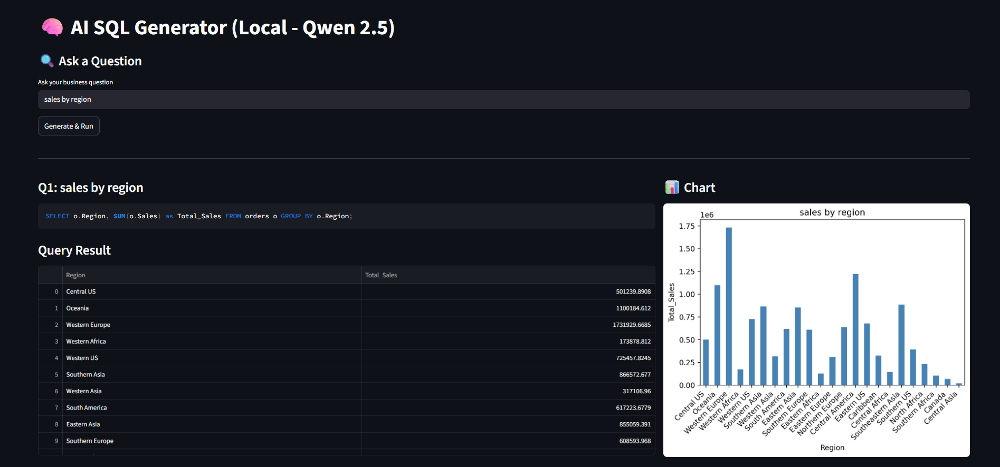

# 🚀 AI-Powered BI Dashboard (Local LLM)

## 📌 Overview
An AI-driven Business Intelligence Dashboard that converts Natural Language queries into SQL and automatically generates visual charts.

This system allows users to ask business questions and instantly receive:

- Generated SQL query
- Executed database result
- Automatic visualization (charts)

---
## 📸 Demo Screenshots

### 🔹 AI BI Dashboard


---

## 🧠 Key Features

✅ Natural Language → SQL generation  
✅ Automatic chart visualization  
✅ AI-powered business insights  
✅ Local LLM execution (No API cost)  
✅ Interactive Streamlit dashboard  
✅ Secure environment configuration  

---

## 🏗️ Architecture Flow

User Question  
⬇  
Local LLM (Ollama - Qwen 2.5 Coder)  
⬇  
Generated SQL Query  
⬇  
Database Execution  
⬇  
Auto Chart Visualization  

---

## 🛠️ Tech Stack

- Python
- Streamlit
- Ollama (Qwen 2.5 Coder)
- Pandas
- SQL
- Matplotlib / Plotly
- Local LLM Architecture

---

## 📦 Installation

```bash
git clone https://github.com/john1003/ai-sql-generator-local-llm.git
cd ai-sql-generator-local-llm
pip install -r requirements.txt
streamlit run App.py
